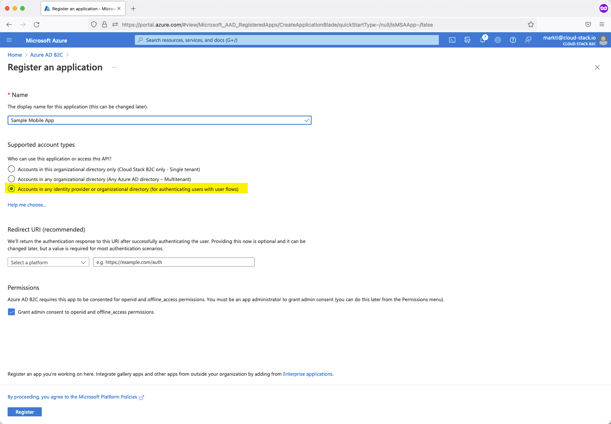
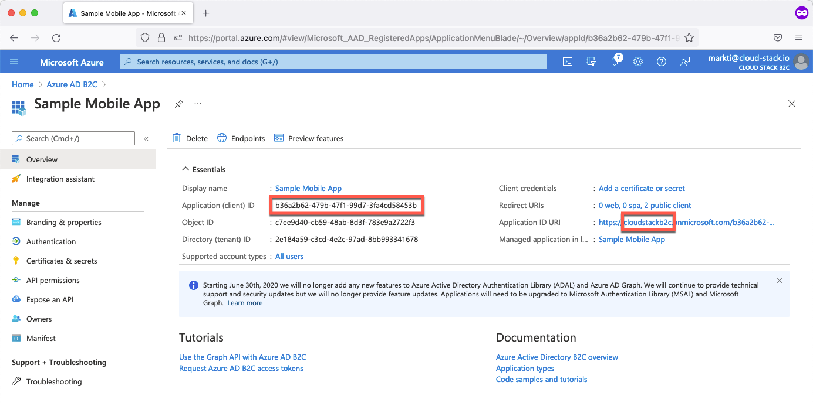
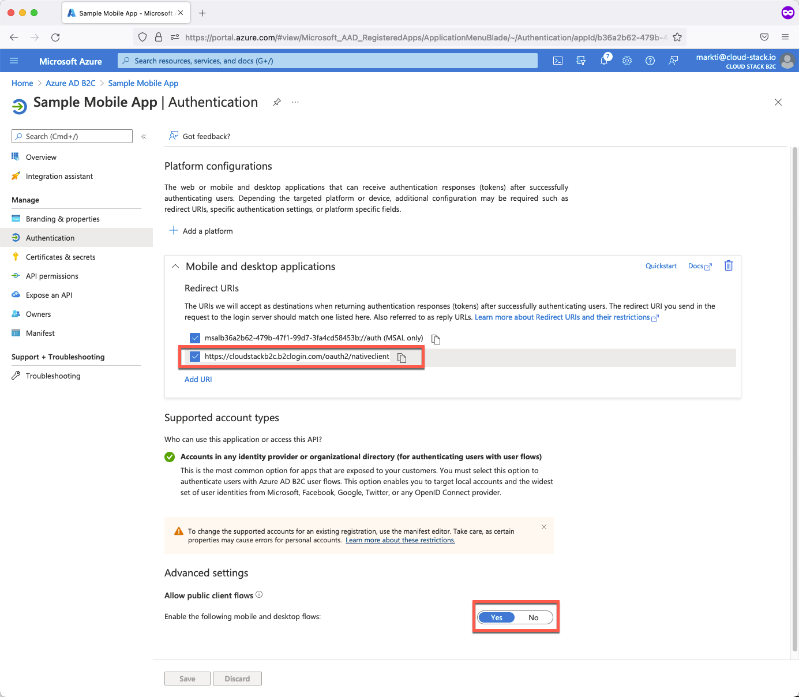
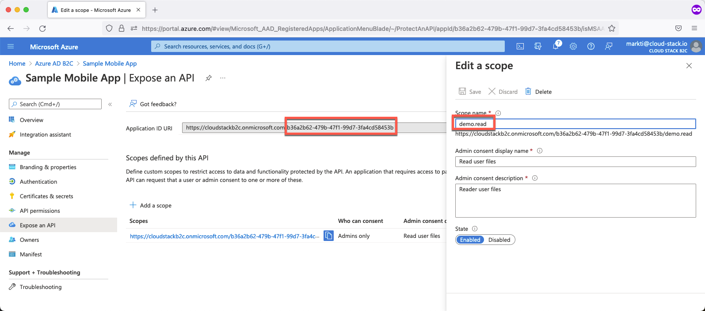
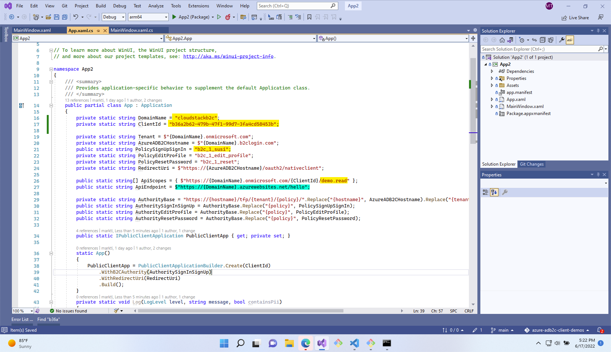

# Overview
I wanted to create a reference application for configuring Azure Active Directory B2C with the latest clients. I thought I would start with UWP WinUI 3 since that appears to be the latest Windows native application stack.

# Create an App Registration

You need to create an app registration in your Azure AD B2C tenant. If you want to support both AAD and Microsoft Accounts (e.g. Hotmail and Outlook.com consumer users) then select the third option "Accounts in any identity provider or organizational directory (for authenticating users with user flows)". Read "Organizational Directory" as your B2B end users that have their own Azure Active Directory account and read "any identity provider" as any other consumer identity provider you enable through the AAD B2C "Identity Providers" configuration.

# Grab your App ID

After your application is created you need to grab two values from the App Registration:

1. Tenant Name
2. Application ID

The Tenant Name and Application ID will be used as the `DomainName` and `ClientId` variables, respectively, in my UWP application code. More on that later.

# Configure a Redirect URI

The OAuth flow that your AAD B2C tenant users to authenticat users requires a redirect URL. If you are building a native mobile application you don't really have something like that because your app runs client-side. Web app developers will know what I am talking about. So for you mobile / native app devs out there just make sure to check one of the default URLs that AAD B2C provides for you out of the box. 

We will use this value when we set the `RedirectUri` in the UWP application code.

# Setup an API Scope

I haven't even started developing an API to go with this app so we can just use a placeholder. Ideally this would be a real scope for some real functionality within your server side API. I'm going to use the `ClientId` to create a Application ID URI and `demo.read` as a scope.

# Configure the UWP Application

Now that we have all the AAD B2C stuff setup, let's configure the codebase! I've set it up so that you just need to set two values. The `DomainName` and the `ClientId` which correspond to the AAD B2C Domain Name and the AAD B2C App Registration's Application ID, respectively.

